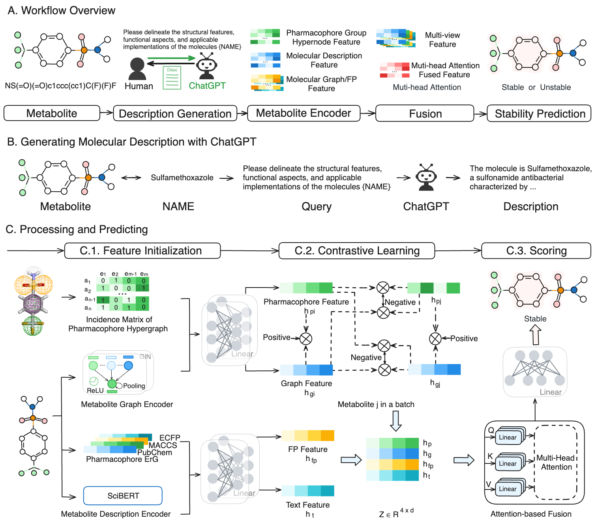

# HyperPhS

## Title
HyperPhS: A pharmacophore-guided multi-view representation for metabolic stability prediction through contrastively hypergraph learning

## Abstract
Metabolic stability is crucial in the early stages of drug discovery and development. Pharmacophores, the functional groups within drug molecules, directly bind to receptors or biological macromolecules to produce biological effects, thereby significantly influencing metabolic stability. Accurately predicting this stability can streamline drug candidate screening and optimize lead compounds. Given the high costs of wet lab experiments, in silico prediction offers a valuable yet underdeveloped alternative. Furthermore, determining metabolic stability using a pharmacophore-guided approach remains a significant challenge.

To address these issues, we develop a novel pharmacophore-guided hypergraph-based approach for metabolic stability prediction named HyperPhS.


## Setup
Please install HyperPhS in a virtual environment to ensure it has conflicting dependencies.
```
Python == 3.8
PyTorch == 2.0
scikit-learn == 1.2.2
pandas == 2.0.2
numpy == 1.23.5
RDKit == 2023.03.1
network == 2.8.4
PyG == 2.3.1
Install pytorch_geometric following instruction at https://github.com/rusty1s/pytorch_geometric
```
## Dataset

The HLM, RLM, and External datasets were adopted from [1],[2].

## Access Processed Text Embedding Data

The processed text embedding data is available via Zenodo: https://doi.org/10.5281/zenodo.13901634

## Run the model
Firstly, to process the data, you will use the `python create_data.py` script.

Secondly, to train the model, you will use the `python training.py` script. This script accepts several command-line arguments to customize the training process.

## Reference

[1] Li, L. et al. (2022). In Silico Prediction of Human and Rat Liver Microsomal Stability via Machine Learning Methods. Chemical Research in Toxicology 35(9), 1614–1624.<br>
[2] Mendez, David, et al. (2019). ChEMBL: towards direct deposition of bioassay data. Nucleic acids research 47.D1, D930-D940.
